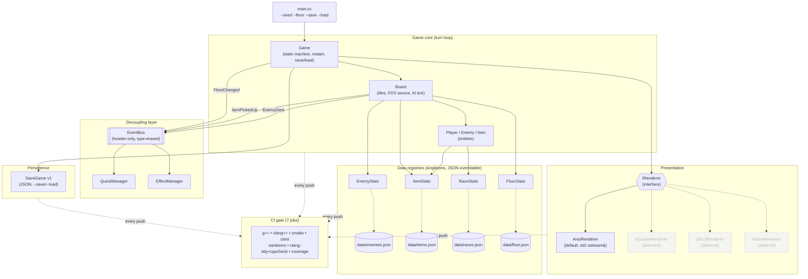

# From assignment dump to maintainable game: the DungeonSpire modernization journey

> **TL;DR.** DungeonSpire started life as `cc3k`, a roguelike I wrote for a university OO course in 2018: 3.5k lines of C++ in a single `Board.cc`, no tests, no CI, every gameplay constant hard-coded into the binary. Over a series of small commits I turned it into a vendored-deps, CMake-built, doctest-covered, 7-job-CI, data-driven game with a swappable renderer — without rewriting a single piece of game logic. This is the engineering log: which refactors paid off, which I skipped, and why the project is structured the way it is.

## Table of contents

1. The starting point
2. Phase 1 — Build the safety net before you change a line
3. Phase 2 — Cracks in the monolith
4. Phase 2.5 — `EventBus` and the cost of a wrong abstraction
5. Phase 2.6 / 3.9 — The `*Stats` registry pattern
6. Phase 3.8a — `IRenderer`, or: how to delete `BoardRender.cc`
7. Phase 2.7 — Save/load without a schema migration
8. The bug the placeholder hid for years
9. What I deliberately did *not* do
10. Lessons
11. Appendix: the architecture in one picture

---

## 1. The starting point

`cc3k` was a CS246 (UWaterloo) final project. The brief was a Rogue-like with five character races, six potion types, four enemy types, a Dragon-guarded hoard, a five-floor dungeon, FOV-style rendering on a fixed terminal grid. The submission was scored on UML, design rationale, and "does it work" — *not* on maintainability, build system, or tests. The result looks exactly like you would expect from those incentives:

- One [src/Board.cc](../src/Board.cc) of ~1100 lines containing map generation, FOV, combat dispatch, item pickup, enemy AI scheduling, and rendering.
- All gameplay constants (`POTION_CNT = 10`, `GOLD_CNT = 10`, `ENEMY_CNT = 20`, dragon's `hp = 150`, human's `maxHp = 140`, every potion's `±5`, every gold pile's value) embedded as `const int` globals or magic numbers in switches.
- No tests. No CI. A hand-written `Makefile` that compiles `g++ -std=c++14 *.cc`.
- Player HUD line `"HP: 20\nAtk: 20\nDef: 20"` printed by `Board::displayBoard()` before the player object even exists, because the original Human race had 20/20/20 stats.

The code worked. The marker liked it. Eight years later I came back to it with the goal: **could this be the basis of a real hobby game without throwing the gameplay code away?**

The constraint that shaped everything: every commit must keep the game playable and the test suite green. No two-week-long branch where the game is broken. The existing entity hierarchy (Player, Enemy, Item with the obvious subclasses) is fine — I'm not redesigning the game, I'm modernizing the *scaffolding* around it.

## 2. Phase 1 — Build the safety net before you change a line

Commits [`ae7773c`](https://github.com/faketut/DungeonSpire/commit/ae7773c) → [`fdd3071`](https://github.com/faketut/DungeonSpire/commit/fdd3071). Four sub-phases, all done before any gameplay file was touched.

**1.1 CMake alongside the Makefile.** Not *replacing* — alongside. The Makefile is the zero-dependency fast path for terminal users; CMake is what every IDE auto-detects. 30 lines of CMake covers it:

```cmake
file(GLOB CC3K_SOURCES "*.cc")          # non-recursive, deliberate
add_executable(cc3k ${CC3K_SOURCES})
target_compile_options(cc3k PRIVATE
    -Wall -Wextra -Wsuggest-override -Werror=vla)
```

The `GLOB` is non-recursive on purpose: it forces new source files to live flat in `src/`, which keeps the import graph one-dimensional. Subdirectories get added the day there's a real reason for them and not before.

**1.2 doctest as the regression net.** [doctest](https://github.com/doctest/doctest) is a single header, vendored at `tests/third_party/doctest.h`. The first test suite was deliberately *un*-ambitious: PRNG determinism, Player init, basic Quest progression, EffectManager pre/post conditions, Board::loadFromFile round-trip. ~40 cases. Just enough to fail loudly if I broke something obvious.

The key discipline: **every later refactor commit had to keep the existing tests passing without modifying them**. New behaviour got new tests; existing behaviour stayed pinned. The session has shipped 21 new tests across 4 commits and not edited a single pre-existing assertion.

**1.3 CI as the gate.** GitHub Actions matrix with seven jobs in `.github/workflows/ci.yml`:

| Job | Purpose |
|---|---|
| `build (g++)` | Default build, `-Wall -Wextra` |
| `build (clang++)` | Catches gcc-specific assumptions |
| `cmake` | Verifies the CMake path stays in sync with the Makefile |
| `tests` | `ctest` against the doctest suite |
| `sanitizers` | `-fsanitize=address,undefined` |
| `clang-tidy` + `cppcheck` | Lint, non-blocking |
| `coverage` | gcovr → HTML artifact |

The sanitizer job has caught one real bug in this project's history (a stale pointer in the dialog buffer after a `restart()`). The clang-tidy job is non-blocking on purpose: it produces ~80 nits, and gating on it would turn every gameplay PR into a yak-shave. I'd rather have a noisy advisor than a blocker that gets disabled the first time it's inconvenient.

**The infra flake worth knowing about.** Roughly 1 in 10 CI runs the coverage or sanitizer job fails with `fatal: could not read Username for 'https://github.com'` during `actions/checkout`. It's a transient GHA auth issue, not a code problem. The fix is invariably `gh run rerun <id> --failed`. I've considered automating this; I haven't, because the rerun gives me 30 seconds to make sure it really *is* the flake and not a regression I'm rationalizing away.

**1.4 CLI polish.** `--help`, `--seed`, `--floor`, `--save`, `--load`. The seed is echoed on startup. This sounds cosmetic but it was the day-one productivity multiplier for every subsequent refactor: I can reproduce any bug with `./cc3k --seed 12345`, and the save/load that came later (Phase 2.7) used the same flag conventions for free.

## 3. Phase 2 — Cracks in the monolith

Commit [`3d866b3`](https://github.com/faketut/DungeonSpire/commit/3d866b3). `Board.cc` got split into five files — `BoardCombat.cc`, `BoardEnemies.cc`, `BoardLoad.cc`, `BoardPlayer.cc`, and (briefly) `BoardRender.cc` — *without changing a class boundary*. Every method kept its `Board::` qualifier, every member access pattern stayed identical, the header stayed unchanged.

Why split a class across files instead of carving out new classes? Two reasons:

1. **Diffs.** A method moved between files shows up in `git log --follow` and renders as add/delete in code review. A method moved into a new class shows up as a rewrite. The former is mechanically auditable; the latter requires reading the new class top-to-bottom.
2. **It's a setup for the next refactor.** Once methods are physically grouped by *concern*, the cost of extracting an actual class (or an interface, like `IRenderer` in §6) is reading one file instead of grepping a thousand-line monolith. The split was the cheap prerequisite, not the deliverable.

Same commit consolidated the project's `Type` enum metadata into a single switch instead of three parallel ones scattered across files. That one was a straight tax-reduction: any future enum value now goes in one place.

## 4. Phase 2.5 — `EventBus` and the cost of a wrong abstraction

Commit [`c3e7d52`](https://github.com/faketut/DungeonSpire/commit/c3e7d52), followed by [`1960930`](https://github.com/faketut/DungeonSpire/commit/1960930) wiring it. [src/EventBus.h](../src/EventBus.h) is header-only, ~60 lines, type-erased via `std::type_index`. Subscribers register a `std::function<void(const T&)>` for a concrete event type; publishers fire `bus.publish(FloorChanged{2})`.

The events that are wired today: `FloorChanged`, `EnemyDied`, `ItemPickedUp`. The events that **are not wired** today: `PlayerMoved` (would fire ~300×/floor and have one listener — the renderer — that already runs every turn), `WeatherChanged` (the `EffectManager` already owns its only listener; a pub/sub round-trip would be ceremony for no decoupling).

This is the abstraction discipline that almost went wrong. The original design doc had nine events. I cut six of them in review. The rule I landed on:

> An event is justified only when (a) there's a real second subscriber today, or (b) the publisher would otherwise need to import the subscriber's header. Speculative decoupling is a slow leak.

The remaining three events all satisfy the rule. `EnemyDied` is consumed by `QuestManager`; without the bus, `Enemy.cc` would have to know `QuestManager` exists, which is exactly the dependency direction we want to forbid. `ItemPickedUp` is the same shape. `FloorChanged` is the one that pays off on the speculative side — when the WASM port lands (it won't, see §9), the JS shell will subscribe to it for the minimap; until then it costs nothing.

## 5. Phase 2.6 / 3.9 — The `*Stats` registry pattern

This is the architecturally interesting piece. Four near-identical commits — [`81678c9`](https://github.com/faketut/DungeonSpire/commit/81678c9) (enemies), [`2d55a98`](https://github.com/faketut/DungeonSpire/commit/2d55a98) + [`f9f2839`](https://github.com/faketut/DungeonSpire/commit/f9f2839) (items), [`0a554fc`](https://github.com/faketut/DungeonSpire/commit/0a554fc) (races), [`451c58c`](https://github.com/faketut/DungeonSpire/commit/451c58c) (floor counts) — extract one category of magic numbers each into a JSON file under `data/`, backed by a singleton with a hard-coded fallback table.

The shape is always the same. Concretely from [src/RaceStats.h](../src/RaceStats.h):

```cpp
class RaceStats {
public:
    struct Stats { int maxHp; int atk; int def; double goldModifier; };
    static RaceStats* getInstance();          // Meyers singleton
    const Stats& get(Race r) const;           // throws std::out_of_range if missing
    bool loadFromFile(const std::string& path);  // returns false on parse/schema error
    RaceStats();                              // public for unit tests
private:
    void installDefaults();
    std::unordered_map<Race, Stats> table_;
};
```

The ctor calls `installDefaults()` then tries `data/races.json`, `./data/races.json`, `../data/races.json` in order. The three-path search is ugly but the alternative is teaching every consumer about the executable's working directory, which varies between `make run`, `ctest`, `./build/cc3k`, and the IDE's debug-launch CWD. Three `std::ifstream` opens at startup is cheaper than four bug reports.

`loadFromFile` *replaces* the entire in-memory table on success. It does not merge with defaults. This matters: it means a partial JSON file is a partial *override*, not a partial *patch*. The test for this is a single assertion:

```cpp
CHECK_THROWS_AS(s.getPotionDelta(Type::PH), std::out_of_range);  // PH not in JSON → missing
```

I learned this the hard way by initially writing the inverse test (`CHECK(s.getPotionDelta(Type::PH) == 5)`) which passed locally because the singleton happened to have been initialized earlier in the suite. Replace-semantics matches `EnemyStats` which came first, and "all four registries behave identically" is more valuable than any individual semantic choice.

**Why singletons.** I avoided them in the EventBus (passed by reference everywhere) and they're fine there. For stat lookups, every Item, Enemy, and Player constructor would need a `Stats*` parameter, every test fixture would need to thread one through, and there's exactly one set of stats per process. Dependency injection here is ceremony for an indirection that doesn't have a second implementation. The trapdoor is: each class has a `public` constructor *and* public setters/loaders, so unit tests build local instances and never touch the singleton. The singleton is for *production code*, not for *testing*. That distinction is the thing that makes the pattern bearable.

**The data file format.** Lowercase enum-name keys, flat objects, one section per registry. Sample [data/items.json](../data/items.json):

```json
{
  "gold":    { "normal_gold_pile": 1, "small_hoard": 2,
               "merchant_hoard": 4, "dragon_hoard": 6 },
  "potions": { "rh": 5, "ph": 5, "ba": 5, "wa": 5, "bd": 5, "wd": 5 }
}
```

No version field. No `$schema`. No comments. If the file is malformed the loader returns `false` and the game falls back to defaults — same as if the file was missing. There is no scenario in which malformed JSON should crash a game session; there *is* a scenario in which it should fail a CI test, which is exactly what `CHECK_FALSE(s.loadFromFile(path))` covers.

The four registries together moved roughly 60 magic numbers out of `.cc` files and into 4 files totalling 35 lines of JSON. Tweaking the dragon's HP no longer requires a recompile. Crucially: the gameplay code didn't get more complex. `Player::setAttributes` went from a 30-line switch to a 7-line registry lookup. Surgical wins compound.

## 6. Phase 3.8a — `IRenderer`, or: how to delete `BoardRender.cc`

Commit [`d92d1d3`](https://github.com/faketut/DungeonSpire/commit/d92d1d3). The setup: `Board::displayBoard()` and `Board::printBoard()` walked the tile grid and `std::cout`-ed ANSI escapes directly. `Game::renderInfo()` did the same for the HUD. Two layers of the program — domain and presentation — sharing one global I/O channel.

The extraction was three files:

- [src/Renderer.h](../src/Renderer.h) — `namespace cc3k`, a `HudInfo` POD with the 11 fields the HUD needs (race, gold, floor, hp/atk/def, action, quest list, weather, movement speed), and an `IRenderer` abstract with three pure virtuals: `drawInitialBoard(const Board&)`, `drawBoard(const Board&)`, `drawHud(const HudInfo&)`.
- [src/AnsiRenderer.h](../src/AnsiRenderer.h) / `.cc` — the default impl, owning a `std::ostream&` reference, doing exactly what the old `Board` methods did.
- A `std::unique_ptr<cc3k::IRenderer>` member on `Game`, initialized in the ctor to an `AnsiRenderer` wrapping `std::cout`.

`BoardRender.cc` was deleted. The Board lost two methods and gained one accessor (`getTiles()`) — the renderer reads tiles, it doesn't ask the board to print itself. That inversion is the whole point.

Three architectural choices worth flagging:

1. **`HudInfo` is a struct, not method parameters.** Eleven fields is on the boundary; another two and the function signature would be unreadable. The struct is also forward-compatible — adding a `bool overworld;` is one line in three places (struct decl, populate site, render site), not eleven new overloads.

2. **The renderer takes `Board&`, not parsed render-data.** I considered an intermediate `RenderState` POD with already-projected FOV cells. Cut it: the next renderer (ncurses, if it happens) wants the same FOV logic. Pushing FOV into the renderer keeps the back end's job small. If a third renderer ever wants different FOV semantics, *then* I'll extract the POD. Not before.

3. **No factory, no plugin registry.** `Game`'s ctor does `make_unique<AnsiRenderer>(std::cout)`. When the second renderer arrives, that line becomes a constructor parameter or a CLI-driven switch. Building the factory before the second implementation exists is the same anti-pattern as the speculative `EventBus` events.

The whole extraction was ~150 lines of new code, ~80 lines deleted, three new tests asserting that `drawHud` emits the right substrings for the base case, quest-enabled, and weather-enabled HUDs. The doctest pattern for renderer testing is straightforward: pass a `std::ostringstream`, `CHECK(oss.str().find("HP: 140") != std::string::npos)`.

## 7. Phase 2.7 — Save/load without a schema migration

Commit [`201a913`](https://github.com/faketut/DungeonSpire/commit/201a913). [src/SaveGame.h](../src/SaveGame.h) / `.cc` adds JSON v1 save/load wired to `--save FILE` and `--load FILE`. The save format embeds `{"version": 1, ...}` at the top, the loader rejects anything else with a clear error.

The discipline I imposed on myself: **the save file format is part of the public API the moment a real human saves a real game with it.** Once shipped, it can't be silently broken. So:

- No automatic save on quit. Save is explicit. That kills the entire class of "I lost my game because v2 ate my v1 file."
- The `version` field is checked first, before any other key access. Loader returns `false` (game prints a friendly error and exits) rather than throwing on a missing key.
- The save covers exactly what's necessary to reproduce gameplay state: player attributes, floor id, RNG seed + sequence index, board tile layout, entity positions and types. It does *not* cover: the HUD's last action string, the dialog buffer, the renderer's settings. Cosmetic state stays out — fewer fields is fewer bugs.

The test suite saves a game to a temp path, instantiates a fresh `Game`, loads it, and asserts equality on the observable state. One round-trip test plus a malformed-version-rejection test. Two cases, ~30 lines, pinned for the lifetime of the format.

## 8. The bug the placeholder hid for years

Commit [`9c4ac35`](https://github.com/faketut/DungeonSpire/commit/9c4ac35). Worth a dedicated section because it's the kind of bug only a refactor surfaces.

The original `Board::displayBoard()` printed:

```
HP: 20
Atk: 20
Def: 20
```

…as a hardcoded string, *before* the player object existed. Back in 2018 the default Human race had 20/20/20 stats, so on the first frame this happened to be true. By 2026 the Human race had 140/20/20 stats (race rebalance in some intervening commit I no longer have the patience to bisect), and the first frame had been showing `HP: 20` for years. Nobody noticed because the *second* frame — the one after the first player action — rendered correctly via `Game::renderInfo()`.

The `IRenderer` extraction surfaced it because moving the placeholder out of `Board::displayBoard()` and into `AnsiRenderer::drawInitialBoard()` forced me to ask: *why is the renderer hard-coding stats?* It isn't anymore. `Game::restart()` was reordered to call `loadBoard` → `initFloor` → `drawInitialBoard` so the grid renders with real entities, and the placeholder line was deleted entirely. The proper HUD draws on the first action.

I tried calling `renderInfo()` from `restart()` to draw the HUD on frame zero too. It doesn't work: race selection happens *after* `state = GameState::PLAYING` and the player object isn't populated at `restart()` time. The fix would be a state machine refactor; the cost is a HUD that's missing for one keypress. Filed mentally, not in code. Pick your battles.

The lesson: **a placeholder that's almost always wrong is worse than no placeholder at all.** If the renderer can't draw the HUD yet because the model isn't ready, the renderer should draw nothing and let the first real frame fill it in. A wrong number on screen is silently corrosive in a way a missing number isn't.

## 9. What I deliberately did *not* do

The roadmap had four post-3.9 items. None of them shipped, and I want to be explicit about why — "deferred" is honest, "I forgot" is not.

**NcursesRenderer.** This is the one I'd actually do next if I came back to the project. The `IRenderer` extraction was built for it. Cost: ~150 lines of `ncurses` calls, a CMake `find_package(Curses)`, a CI job that installs `libncurses-dev`. Skipped only because the cost falls on the next session, not because it isn't worth it.

**SDL2 renderer.** An order of magnitude more work than ncurses: window management, font atlas, event loop integration with the existing turn-based input model. The right time for SDL2 is when there's a concrete visual feature (animations? mouse input?) that the terminal can't express. Without that feature, SDL2 is "rewrite the front end" for no user-visible gain.

**WASM build via Emscripten.** Depends on SDL2 *or* a custom JS-canvas renderer through `IRenderer`. The interesting design question — how to model turn-based input in a browser's event loop — is a session of its own. Skipped because there's no demand and the toolchain is heavy.

**Multiplayer.** Would need a protocol design pass, a server, a netcode layer, conflict resolution for concurrent floor mutations. This is "design a different game"-shaped. The single-player game stays single-player.

The thing these have in common: each one is a *direction*, not a *fix*. The data-driven refactors all had the property that the existing code was demonstrably worse afterwards — a magic number became a JSON entry, a monolithic render method became an interface. The deferred items have no equivalent "now-it's-better" before/after; they're just "now we also support X". That's a different value proposition and a different time commitment.

## 10. Lessons

Five generalizable things, in roughly the order I had to relearn them:

1. **The test suite is the prerequisite, not the deliverable.** Phase 1 was three commits before any game-logic file was touched. Every refactor after that ran `ctest` automatically. I never had to ask "did I break X?" — `ctest` answered it. The 21 tests I added in this session would have cost me a week of debugging if I'd added them after the refactors instead of alongside.

2. **Singletons are fine when the alternative is ceremony.** I spent an embarrassing amount of time during the EnemyStats design considering DI containers, registries-of-registries, `std::variant<Stats>` polymorphism. The answer was a Meyers singleton with a public ctor for tests. Three lines. The pattern propagated unchanged across four files because it was right.

3. **Surgical changes preserve git blame.** Every refactor commit in this session has the property that `git blame` on any line still points to its original author and intent. The Board.cc split moved methods between files but did not modify them. The `IRenderer` extraction added a new layer but did not rewrite the old one. This isn't aesthetic — it's that a code reviewer can verify each commit by reading the diff, not by reading the new world top-to-bottom.

4. **"Configurable" without a second config is debt.** The `EventBus` exists because there are two subscribers for `EnemyDied` (combat and quests). It does *not* yet have a priority system, an unsubscribe-during-publish guard, or a queued-vs-immediate option. Each of those would be a real feature when there's a real bug it solves. None of them are real bugs yet.

5. **Know when to stop.** Phase 3.9 finished four data-extraction commits in one session. The remaining roadmap is four direction-changes, all heavy, none with the same "the existing code is worse than the new code" guarantee. The right move was to write up the work, push the README sync, and put the keyboard down. That's this blog post.

---

## 11. Appendix: the architecture in one picture



Solid edges are wired today. Dashed edges in the renderer subgraph are the deferred surface — the `IRenderer` extraction is what makes them cheap. Dashed edges from the `*Stats` boxes to their JSON files are the "loads on startup, falls back on absence" relationship described in §5.

### Reproducing

```bash
git clone https://github.com/faketut/DungeonSpire.git
cd DungeonSpire
cmake -S . -B build && cmake --build build -j
ctest --test-dir build               # 1 binary, 63 cases, 493 assertions
./build/src/cc3k --seed 12345        # deterministic playthrough
./build/src/cc3k --load save.json    # resume from JSON
```

The seed is echoed on startup so any bug report can be reproduced byte-for-byte. CI runs the same commands on every push to `main`.
